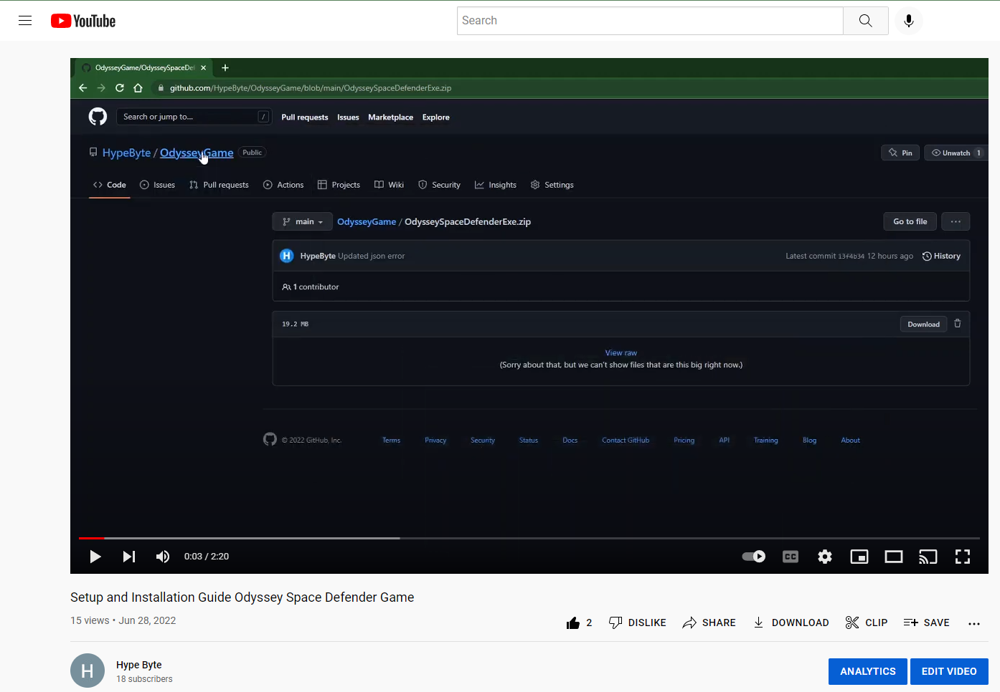
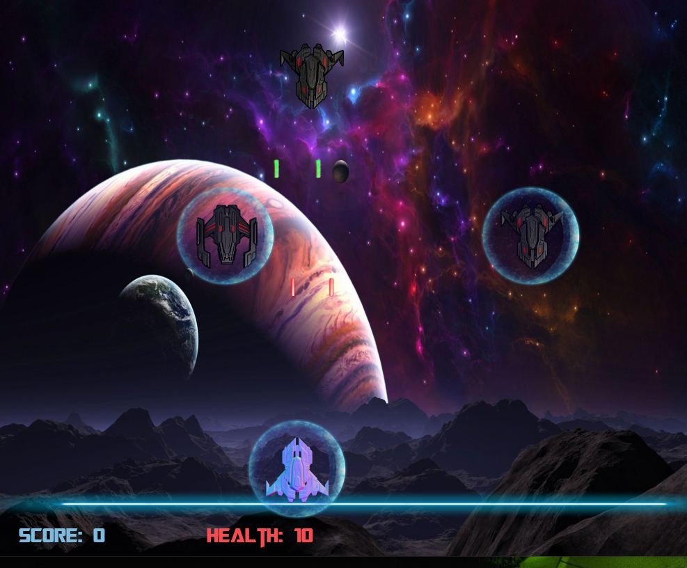

# OdysseyGame
Programmed with Python using Pygame API
<h1>How to Install</h1>
<a href="https://www.youtube.com/watch?v=KCxFUK-ZC0I&t=26s&ab_channel=HypeByte"><h2>Installation Video</h2></a>
</img>
<h1>Gameplay</h1>
<a href="https://www.youtube.com/watch?v=C6q6Rs6dH6c&ab_channel=HypeByte">Gameplay video</a>
</img>

